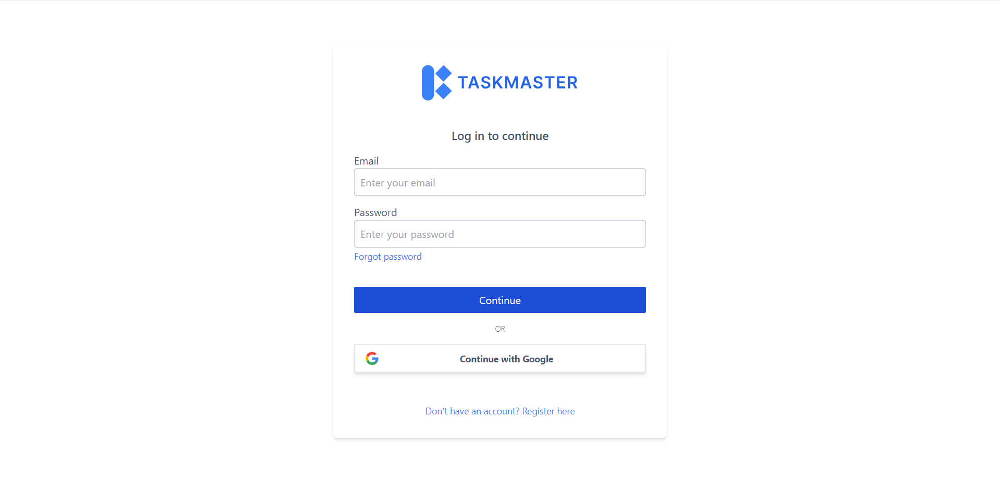
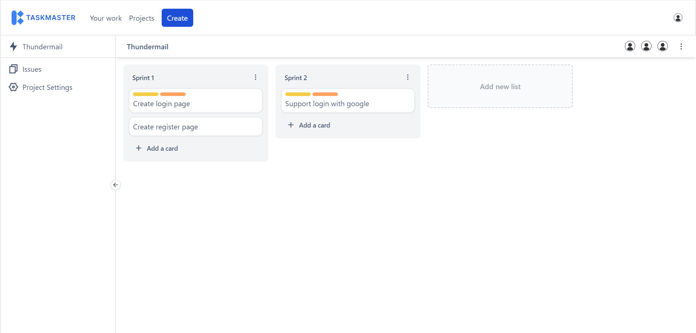
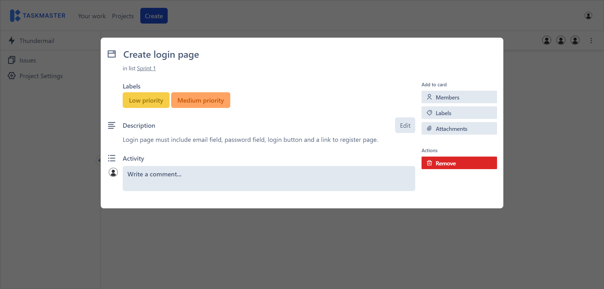
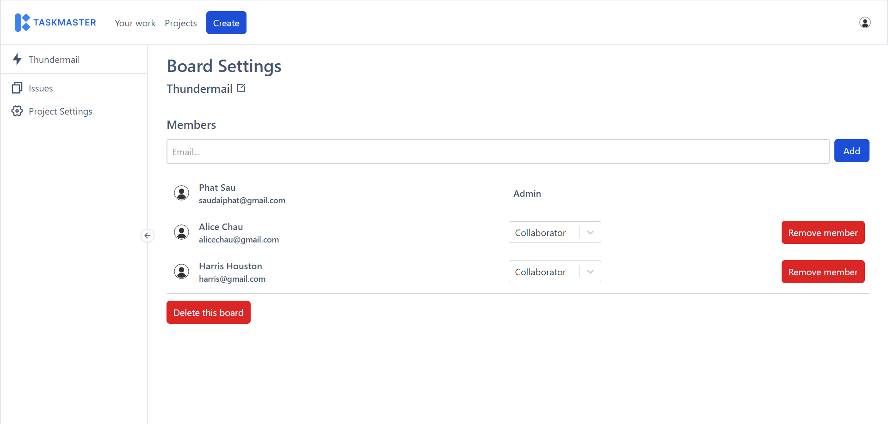

<p align="center">
  
</p>

## Description

Taskmaster is an issues tracking app that helps developer tracking bugs, collaborating with co-workers seamlessly.

## Screenshot





## Features
- Authentication: Login, register, login with google, forgot password
- Invite other users to your board by sending invitation link via email
- Change board member role with different permission. There are three currently supported roles, which are: Admin, Collaborator, Observer.
- User can interact with cards in a board in many ways:
  - Edit board title, description
  - Add a comment
  - Add attachments, only image files are supported at the moment
  - Add labels with many preset colors to choose from
  - Tag board member
  - Change card order in a list or put it in another list
- Update user profile

## Installation

```bash
$ npm install
```

There are two environment files that are needed to be configured: <code>.env</code> for production and <code>.env.development</code> for development. Fill in those files as described in <code>.env.example</code>.

## Testing accounts
| Username      | Password |
| ----------- | ----------- |
| saudaiphat@gmail.com      | 12345678       |
| alicechau@gmail.com   | 12345678        |
| hamza@gmail.com     | 12345678 |

## Running the app

```bash
# development
$ npm run dev

# build project
$ npm run build

# run in production mode
$ npm run preview
```